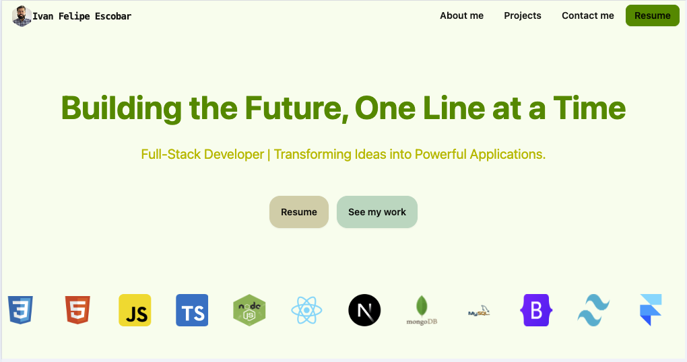

# Professional Portfolio for Ivan Escobar 

## Description

Dive into my professional portfolio, meticulously sculpted with React in TypeScript, adorned with the elegance of Tailwind CSS and the enchantment of Framer Motion. This Single Page Application (SPA) is not just a showcase; it's an experience, carefully curated to captivate and engage.

Seamless navigation awaits, courtesy of simple id links, guiding you effortlessly through the digital landscape. Your journey commences with a mesmerizing parallax, featuring Piedmont Park, its hues intricately modified to harmonize with the portfolio's ambiance, beckoning you towards the About section.

Within the About section lies a glimpse into my story, encapsulated in a succinct paragraph, accompanied by an enticing button that unveils a modal, inviting you to delve deeper into my biography.

Prepare to be enchanted further as you encounter the dynamic second parallax, gracefully shrinking with each scroll, fostering interaction and immersion. This dynamic transition leads you to the Projects section, where a captivating carousel awaits, showcasing a diverse array of projects, each accompanied by detailed descriptions and pertinent links.

The narrative unfolds seamlessly with yet another parallax, showcasing the mesmerizing allure of Howard Finster's Paradise Gardens, seamlessly guiding you towards the Contact section. Here, social links stand ready for connection, while a strategically placed button opens a modal, presenting a convenient contact form for your inquiries.

Embark on this digital odyssey and witness the fusion of creativity and professionalism in every facet. Your visit is sincerely appreciated.

[Deployed Application](https://www.ivanfelipe.com/)

[GitHub Repo](https://github.com/IvanFelipeEscobar/portfolio)

## Contact 

Single page application created be Ivan Felipe Escobar, email me at IvnEscbr1989@gmail.com! You can see this and my other projects at: 
[GitHub Repo](https://github.com/IvanFelipeEscobar/portfolio)

 
